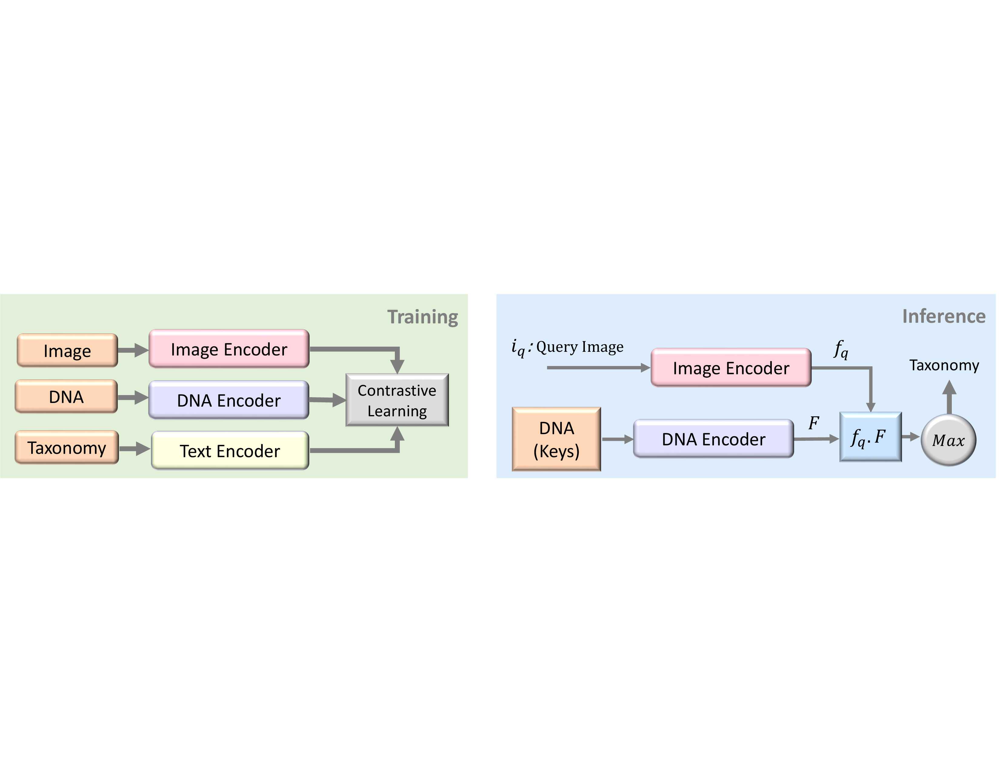

# BIOSCAN-5M



###### <h3> Overview
Our experiments using the BIOSCA-CLIP baseline [Paper](https://arxiv.org/abs/2405.17537) are conducted in two steps. 
- (1) Training Stage: Multiple modalities, including RGB images, textual taxonomic labels, and DNA nucleotide sequences, are encoded separately. 
The feature representation vectors from the encoders are trained using a contrastive loss function to align the image, DNA, and text embeddings. 
- (2) Inference Stage: An image query is embedded, and its feature representation is compared to those obtained 
from a database of existing image and DNA embeddings (keys). The cosine similarity is used to find the closest key embedding, and the corresponding taxonomic label is used to classify the query image.

## Set environment
For now, you can set the environment by typing
```shell
conda create -n bioscan-clip-6M python=3.10
conda activate bioscan-clip-6M
conda install pytorch=2.0.1 torchvision=0.15.2 torchtext=0.15.2 pytorch-cuda=11.7 -c pytorch -c nvidia
pip install -r requirements.txt
pip install git+https://github.com/openai/CLIP.git
conda install -c conda-forge faiss

```
in the terminal. However, based on your GPU version, you may have to modify the torch version and install other packages manually in difference version.
## Link metadata to BIOSCAN_CLIP data folder
```shell
# From project folder
mkdir -p data/BIOSCAN_6M/
ln -s {Absolute path to the metadata tsv file} data/BIOSCAN_6M/BIOSCAN_6M_metadata.tsv
```

## Download checkpoint for BarcodeBERT
```shell
# From project folder
mkdir -p ckpt/BarcodeBERT/5_mer
cd ckpt/BarcodeBERT/5_mer
wget https://aspis.cmpt.sfu.ca/projects/bioscan/clip_project/ckpt/BarcodeBERT/model_41.pth
```

TODO: Refactor following parts.

## Train
```shell
# From project folder
python scripts/train_cl.py 'model_config={config_name}'
```
For example
```shell
# From project folder
python scripts/train_cl.py 'model_config=lora_vit_lora_barcode_bert_ssl.yaml'
```
For multiple GPU, you may have to
```shell
NCCL_P2P_LEVEL=NVL python scripts/train_cl.py 'model_config=lora_vit_lora_barcode_bert_ssl.yaml'
```

## Eval
```shell
# From project folder
python scripts/inference_and_eval.py 'model_config=lora_vit_lora_barcode_bert_lora_bert_ssl'
```
