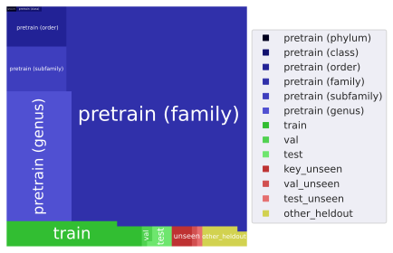

BIOSCAN-5M
----------
<figure style="text-align: center;">
  
  <figcaption><b>Figure 1:</b> A BIOSCAN-5M dataset sample.</figcaption>
</figure>

Overview
========
This repository contains the code and data related to the to the [BIOSCAN-5M](https://biodiversitygenomics.net/5M-insects/)
dataset.
BIOSCAN-5M is a comprehensive multi-modal dataset comprised of over 5 million specimens, 98% of which are insects.
Every record has **both image and DNA** data.

If you make use of the BIOSCAN-5M dataset and/or this code repository, please cite the following [paper](https://arxiv.org/abs/2406.12723):

```bibtex
@misc{gharaee2024bioscan5m,
    title={{BIOSCAN-5M}: A Multimodal Dataset for Insect Biodiversity},
    author={Zahra Gharaee and Scott C. Lowe and ZeMing Gong and Pablo Millan Arias
        and Nicholas Pellegrino and Austin T. Wang and Joakim Bruslund Haurum
        and Iuliia Zarubiieva and Lila Kari and Dirk Steinke and Graham W. Taylor
        and Paul Fieguth and Angel X. Chang
    },
    year={2024},
    eprint={2406.12723},
    archivePrefix={arXiv},
    primaryClass={cs.LG},
    doi={10.48550/arxiv.2406.12723},
}
```

Dataset
=======
We present BIOSCAN-5M dataset to the machine learning community.
We hope this dataset will facilitate the development of tools to automate aspects of the monitoring of global insect biodiversity.

Each record of the BIOSCAN-5M dataset contains six primary attributes:
* RGB image
* DNA barcode sequence
* Barcode Index Number (BIN)
* Biological taxonomic classification
* Geographical information (latitude/longitude)
* Specimen size


### Dataset Access

All dataset image packages and metadata are accessible for download through the
[GoogleDrive](https://drive.google.com/drive/u/1/folders/1Jc57eKkeiYrnUBc9WlIp-ZS_L1bVlT-0) folder.

###### <h3> Copyright and License 
The images included in the BIOSCAN-1M Insect dataset available through this repository are subject to copyright 
and licensing restrictions shown in the following:

 - Copyright Holder: CBG Photography Group
 - Copyright Institution: Centre for Biodiversity Genomics (email:CBGImaging@gmail.com)
 - Photographer: CBG Robotic Imager
 - Copyright License: Creative Commons Attribution 3.0 Unported ([CC BY 3.0](https://creativecommons.org/licenses/by/3.0/))
 - Copyright Contact: collectionsBIO@gmail.com
 - Copyright Year: 2021

### Metadata 
The dataset metadata file **BIOSCAN_5M_Insect_Dataset_metadata** contains biological information, geographic information as well as 
size information of the organisms. We provide this metadata in both CSV and JSONLD file types.


### RGB Image 
The BIOSCAN-5M dataset comprises resized and cropped images.
We have provided various packages of the BIOSCAN-5M dataset, each tailored for specific purposes.

<figure style="text-align: center;">
  
  <figcaption><b>Figure 2:</b> Examples of the original images of the BIOSCAN-5M dataset.</figcaption>
</figure>

#### Image packages
* **BIOSCAN_5M_original**: The raw images of the dataset.
* **BIOSCAN_5M_cropped**: Images after cropping with our cropping tool introduced in [BIOSCAN-1M](https://github.com/zahrag/BIOSCAN-1M).
* **BIOSCAN_5M_original_256**: Original images resized to 256 on their shorter side. 
* **BIOSCAN_5M_cropped_256**: Cropped images resized to 256 on their shorter side.
 

<table>
  <thead>
    <tr style="background-color: #f2f2f2;">
      <th>BIOSCAN_5M_original</th>
      <th>BIOSCAN_5M_cropped</th>
    </tr>
  </thead>
  <tbody>
    <tr>
      <td>
        <ul>
          <li>BIOSCAN_5M_original.zip.001</li>
          <li>BIOSCAN_5M_original.zip.002</li>
          <li>BIOSCAN_5M_original.zip.003</li>
          <li>BIOSCAN_5M_original.zip.004</li>
          <li>BIOSCAN_5M_original.zip.005</li>
        </ul>
      </td>
      <td>
        <ul>
          <li>BIOSCAN_5M_cropped.zip.001</li>
          <li>BIOSCAN_5M_cropped.zip.002</li>
        </ul>
      </td>
    </tr>
    <tr style="background-color: #f2f2f2;">
      <th>BIOSCAN_5M_original_256</th>
      <th>BIOSCAN_5M_cropped_256</th>
    </tr>
    <tr>
      <td>
        <ul>
          <li>BIOSCAN_5M_original_256.zip</li>
          <li>BIOSCAN_5M_original_256_pretrain.zip</li>
          <li>BIOSCAN_5M_original_256_train.zip</li>
          <li>BIOSCAN_5M_original_256_eval.zip</li>
        </ul>
      </td>
      <td>
        <ul>
          <li>BIOSCAN_5M_cropped_256.zip</li>
          <li>BIOSCAN_5M_cropped_256_pretrain.zip</li>
          <li>BIOSCAN_5M_cropped_256_train.zip</li>
          <li>BIOSCAN_5M_cropped_256_eval.zip</li>
        </ul>
      </td>
    </tr>
  </tbody>
</table>


### Geographical Information
The BIOSCAN-5M dataset provides Geographic information associated with the collection sites of the organisms:
* Latitude and Longitude coordinates
* Country
* Province or State

<figure style="text-align: center;">
  
  <figcaption><b>Figure 3:</b> Locations obtained from latitude and longitude coordinates associated with the sites of collection.</figcaption>
</figure>

<br><br>

<figure style="text-align: center;">
  
  <figcaption><b>Figure 4:</b> Countries associated with the sites of collection.</figcaption>
</figure>


### Size Information
The BIOSCAN-5M dataset provides information about size of the organisms:
* Image measurement value: Total number of pixels occupied by the organism

Furthermore, utilizing our cropping tool, we calculated the following information about size of the organisms:
* Area fraction: Fraction of the original image, the cropped image comprises.
* Scale factor: Ratio of the cropped image to the cropped and resized image.

<figure style="text-align: center;">
  
  <figcaption><b>Figure 5:</b> Examples of original images (top) and their corresponding masks (bottom) depicting pixels occupied by the organism.</figcaption>
</figure>

### Cropped images
We trained a model on examples from this dataset in order to create a tool which can automatically generate bounding boxes around the insect.
We used this to crop each image down to only the region of interest.

<figure style="text-align: center;">
  
  <figcaption><b>Figure 6:</b> Examples of the original images with the bounding box detected by our cropping tool.</figcaption>
</figure>

### Non-insect organisms
In addition to insects (98% of specimens), the BIOSCAN-5M dataset also contains arthropods from non-insect taxonomic classes.
These are primarily arachnids and springtails (Collembola).

<figure style="text-align: center;">
  
  <figcaption><b>Figure 7:</b> Examples of the original images of non-insect organisms.</figcaption>
</figure>

Benchmark Experiments
=====================

### Data Partitions
We partitioned the BIOSCAN-5M dataset into splits for both closed-world and open-world machine learning problems. 
To use our partitions we propose, see the <code>split</code> field of the metadata file(s).


* The **closed-world** classification task uses samples labelled with a scientific name for their species
(<code>train</code>, <code>val</code>, and <code>test</code> partitions).
  * This task requires the model to correctly classify new images and DNA barcodes of across a known set of species labels that were seen during training.

* The **open-world** classification task uses samples whose species name is a placeholder name,
and whose genus name is a scientific name
(<code>key_unseen</code>, <code>val_unseen</code>, and <code>test_unseen</code> partitions).
  * This task requires the model to correctly group together new species that were not seen during training.
  * In the retreival paradigm, this task can be performed using <code>test_unseen</code> records as queries against keys from the <code>key_unseen</code> records.
  * Alternatively, this data can be evaluated at the genus-level by classification via the species in the <code>train</code> partition.

* Samples labelled with placeholder species names, and whose genus name is not a scientific name are placed in the <code>other_heldout</code> partition.
  * This data can be used to train an unseen species novelty detector.

* Samples without species labels are placed in the <code>pretrain</code> partition, which comprises 90% of the data.
  * This data can be used for self-supervised or semi-supervised training. 


<div align="center">
  
  <p><b>Figure 8:</b> Treemap diagram showing number of samples per partition. For the pretrain partition (blues), we provide a further breakdown indicating the most fine-grained taxonomic rank that is labelled for the samples. For the remainder of the partitions (all of which are labelled to species level) we show the number of samples in the partition. Samples for seen species are shown in shades of green, and unseen in shades of red.</p>
</div>


### DNA-based taxonomic classification
Two stages of the proposed semi-supervised learning set-up based on [BarcodeBERT](https://arxiv.org/abs/2311.02401). 
1. Pretraining: DNA sequences are tokenized using non-overlapping k-mers and 50% of the tokens are masked for the MLM task. 
Tokens are encoded and fed into a transformer model. The output embeddings are used for token-level classification. 
2. Fine-tuning: All DNA sequences in a dataset are tokenized using non-overlapping $k$-mer tokenization and all tokenized sequences, without masking, are passed through the pretrained transformer model.  Global mean-pooling is applied over the token-level embeddings and the output is used for taxonomic classification.
<figure style="text-align: center;">
  
  <figcaption><b>Figure 9:</b> BarcodeBERT model architecture.</figcaption>
</figure>

### Zero-shot transfer learning
We follow the experimental setup recommended by [zero-shot clustering](https://arxiv.org/abs/2406.02465),
expanded to operate on multiple modalities.
1. Take pretrained encoders.
2. Extract feature vectors from the stimuli by passing them through the pretrained encoder.
3. Reduce the embeddings with UMAP.
4. Cluster the reduced embeddings with Agglomerative Clustering.
5. Evaluate against the ground-truth annotations with Adjusted Mutual Information.

<figure style="text-align: center;">
  
  <figcaption><b>Figure 10:</b> BIOSCAN-ZSC model architecture.</figcaption>
</figure>

### Multimodal retrieval learning
Our experiments using the [BIOSCAN-CLIP](https://arxiv.org/abs/2405.17537) are conducted in two steps. 
1. Training: Multiple modalities, including RGB images, textual taxonomy, and DNA sequences, are encoded separately, 
and trained using a contrastive loss function. 
2. Inference: Image vs DNA embedding is used as a query, and compared to the embeddings obtained from a database of image, 
DNA and text (keys). The cosine similarity is used to find the closest key embedding, and the corresponding taxonomic label is used to classify the query.

<figure style="text-align: center;">
  
  <figcaption><b>Figure 11:</b> BIOSCAN-CLIP model architecture.</figcaption>
</figure>

