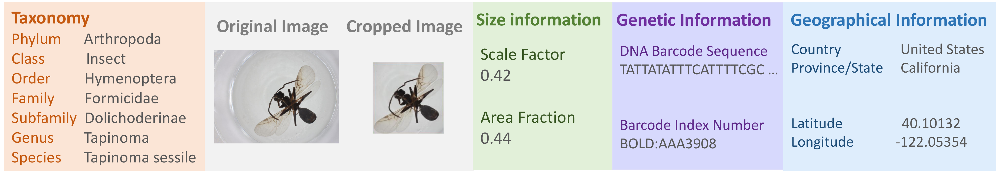
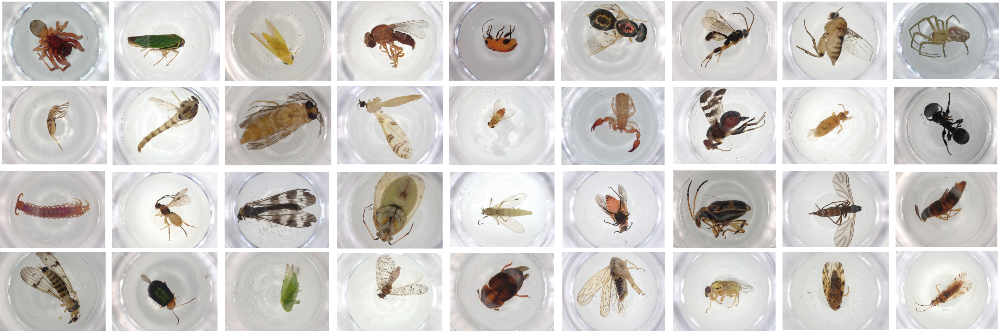
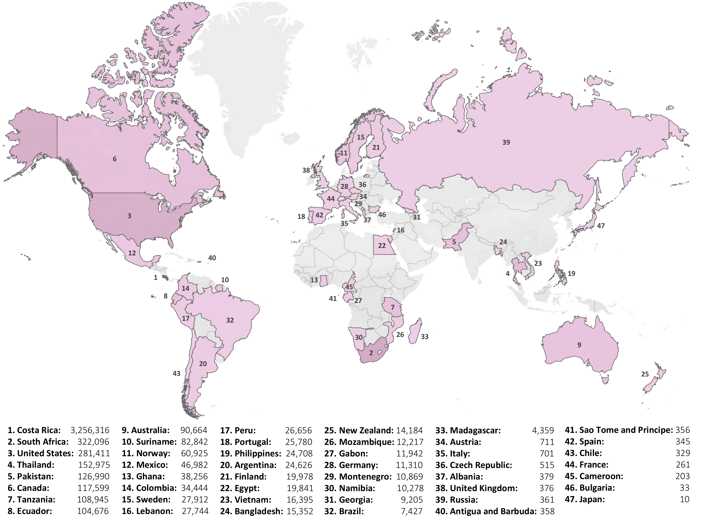
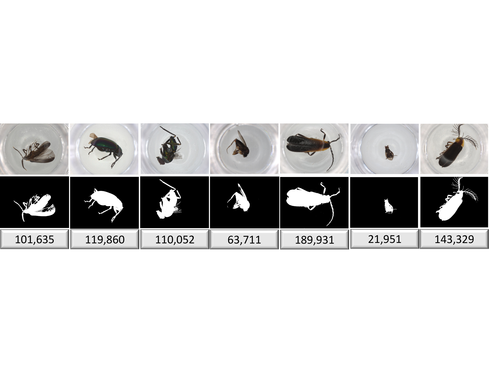
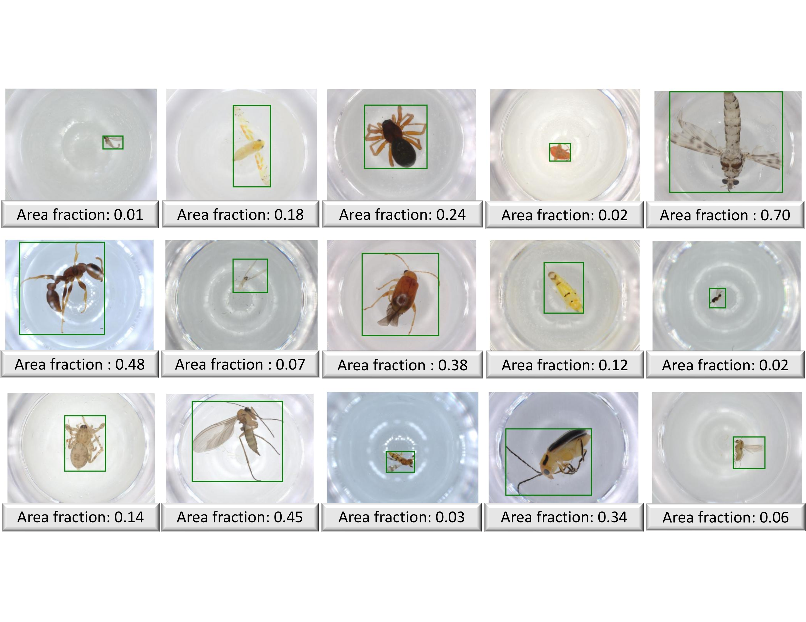
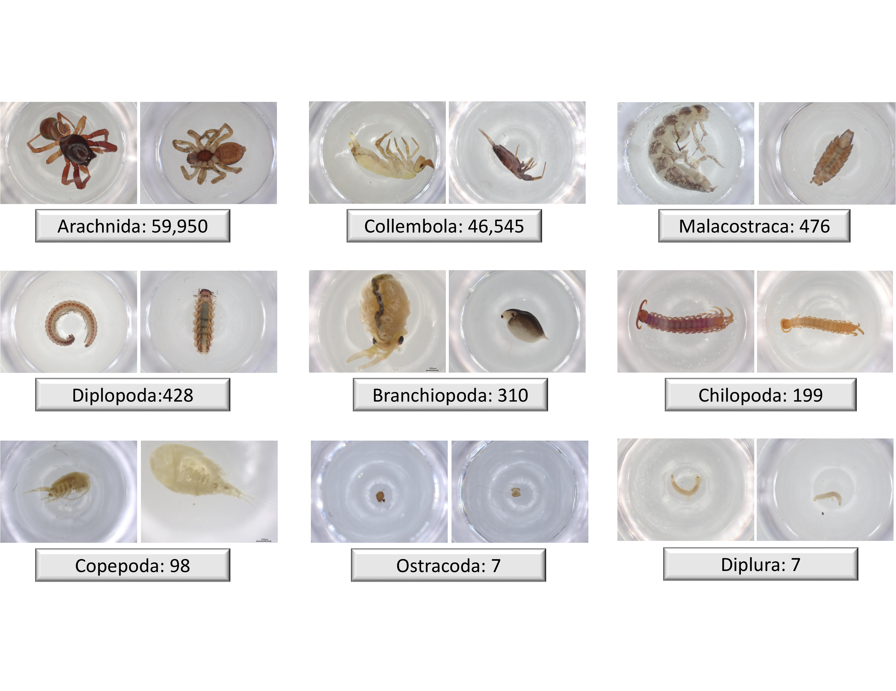
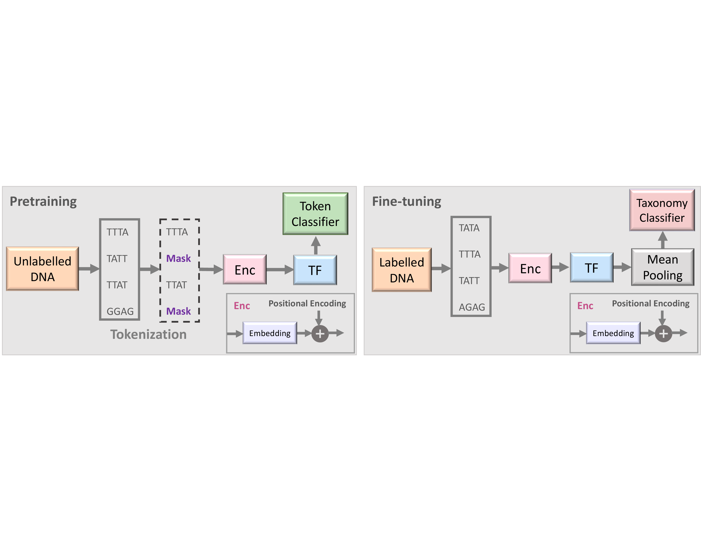
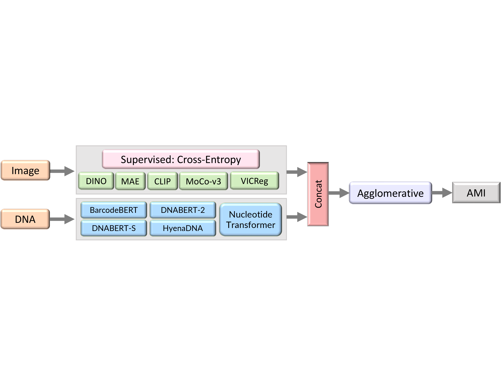
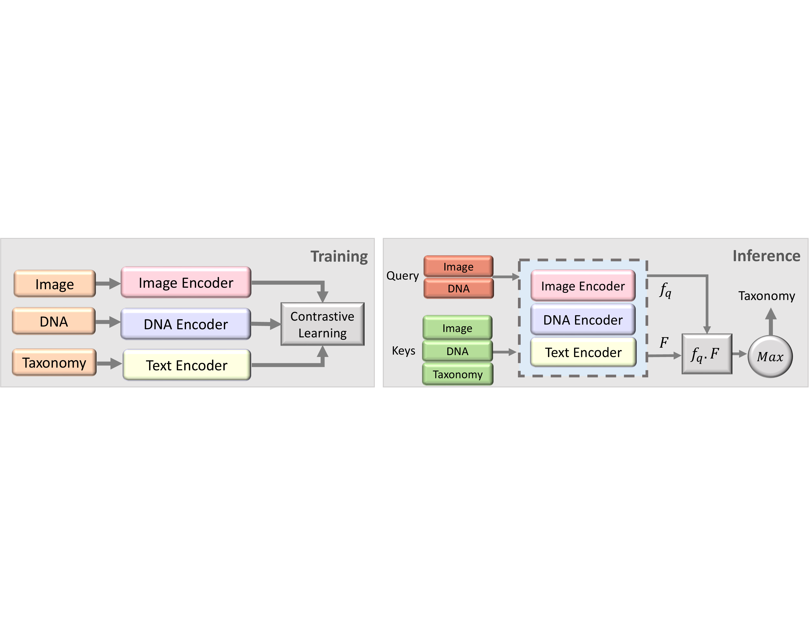

# BIOSCAN-5M
<figure style="text-align: center;">
  
  <figcaption><b>Figure 1:</b> A BIOSCAN-5M dataset sample.</figcaption>
</figure>

##### <h2> Overview
This repository contains the code and data related to the to the [BIOSCAN-5M ](https://biodiversitygenomics.net/5M-insects/)
dataset.  
BIOSCAN-5M is a comprehensive dataset comprising multi-modal information about over 5 million specimens, with 98% being insects. 

Anyone interested in using BIOSCAN-5M dataset and/or the corresponding code repository, 
please cite the [Paper]():

```
@inproceedings{gharaee24,
    title={BIOSCAN-5M: A Multimodal Dataset for Insect Biodiversity},
    author={Gharaee, Z. and Lowe, S. C. and Gong, Z. and Arias. P. M. and Pellegrino, N. and Wang, A. T. 
    and Haurum, J. B. and Zarubiieva, I. and Kari, L. and Steinke, D. and Taylor, G. W. and Fieguth, P. and Chang, A. X.},
    publisher={arxiv},
    year={2024},
}
```

##### <h2> Dataset
We present BIOSCAN-5M dataset to the machine learning community with valuable information about insect's biodiversity. 
Each record of the BIOSCAN-5M dataset contains six primary attributes:
* DNA Barcode Sequence
* Barcode Index Number (BIN)
* Biological Taxonomy Classification
* RGB image
* Geographical information 
* Size information


##### <h3> Dataset Access
The dataset image packages and metadata file are accessible for download through 
the [GoogleDrive](https://drive.google.com/drive/u/1/folders/1Jc57eKkeiYrnUBc9WlIp-ZS_L1bVlT-0) folder.

###### <h3> Metadata 
The dataset metadata file **BIOSCAN_5M_Insect_Dataset_metadata** contains biological information, geographic information as well as 
size information of the organisms. We created both CSV and JSONLD types of the metadata file.

###### <h3> RGB Image 

<figure style="text-align: center;">
  
  <figcaption><b>Figure 2:</b> Examples of the original images of the BIOSCAN-5M dataset.</figcaption>
</figure>


The BIOSCAN-5M dataset comprises resized and cropped images.
We have provided various packages of the BIOSCAN-5M dataset, each tailored for specific purposes.

* BIOSCAN_5M_original.zip: The raw images of the dataset.
* BIOSCAN_5M_cropped.zip: Images after cropping with our cropping tool introduced in [BIOSCAN_1M](https://github.com/zahrag/BIOSCAN-1M).
* BIOSCAN_5M_original_256.zip: Original images resized to 256 on their shorter side.
  * BIOSCAN_5M_original_256_pretrain.zip
  * BIOSCAN_5M_original_256_train.zip
  * BIOSCAN_5M_original_256_eval.zip
* BIOSCAN_5M_cropped_256.zip: Cropped images resized to 256 on their shorter side.
  * BIOSCAN_5M_cropped_256_pretrain.zip
  * BIOSCAN_5M_cropped_256_train.zip
  * BIOSCAN_5M_cropped_256_eval.zip


###### <h3> Geographical Information
The BIOSCAN-5M dataset provides Geographic information associated with the collection sites of the organisms:
* Latitude and Longitude coordinates
* Country
* Province or State

<figure style="text-align: center;">
  
  <figcaption><b>Figure 3:</b> Locations obtained from latitude and longitude coordinates associated with the sites of collection.</figcaption>
</figure>

<figure style="text-align: center;">
  
  <figcaption><b>Figure 4:</b> Countries associated with the sites of collection.</figcaption>
</figure>


###### <h3> Size Information
The BIOSCAN-5M dataset provides information about size of the organisms:
* Image measurement value: Total number of pixels occupied by the organism

Furthermore, utilizing our cropping tool, we calculated the following information about size of the organisms:
* Area fraction: Fraction of the original image, the cropped image comprises.
* Scale factor: Ratio of the cropped image to the cropped and resized image.

<figure style="text-align: center;">
  
  <figcaption><b>Figure 5:</b> Examples of original images (top) and their corresponding masks (bottom) depicting pixels occupied by the organism.</figcaption>
</figure>

<figure style="text-align: center;">
  
  <figcaption><b>Figure 6:</b> Examples of the original images with the bounding box detected by our cropping tool.</figcaption>
</figure>

###### <h3> Non-insect organisms
The BIOSCAN-5M dataset contains non-insect taxonomic classes with a total of 137,479 organisms.

<figure style="text-align: center;">
  
  <figcaption><b>Figure 6:</b> Examples of the original images of non-insect organisms.</figcaption>
</figure>

###### <h2> Benchmark Experiments

###### <h3> DNA-based taxonomic classification
Two stages of the proposed semi-supervised learning set-up based on [BarcodeBERT](https://arxiv.org/abs/2311.02401). 
* (1) Pretraining: DNA sequences are tokenized using non-overlapping k-mers and 50% of the tokens are masked for the MLM task. 
Tokens are encoded and fed into a transformer model. The output embeddings are used for token-level classification. 
* (2) Fine-tuning: All DNA sequences in a dataset are tokenized using non-overlapping $k$-mer tokenization and all tokenized sequences, without masking, are passed through the pretrained transformer model.  Global mean-pooling is applied over the token-level embeddings and the output is used for taxonomic classification.
<figure style="text-align: center;">
  
  <figcaption><b>Figure 8:</b> BarcodeBERT model architecture.</figcaption>
</figure>

###### <h3> Zero-shot transfer learning
We follow the experimental setup recommended by [BIOSCAN_ZSC](https://arxiv.org/abs/2406.02465). 
* (1) Take pretrained encoders. 
* (2) Extract feature vectors from the stimuli by passing them through an encoder. 
* (3) Cluster the reduced embeddings with Agglomerative Clustering. 
* (4) Evaluate against the ground-truth annotations with Adjusted Mutual Information.

<figure style="text-align: center;">
  
  <figcaption><b>Figure 9:</b> BIOSCAN-ZSC model architecture.</figcaption>
</figure>

###### <h3> Multimodal retrieval learning
Our experiments using the [BIOSCAN-CLIP](https://arxiv.org/abs/2405.17537) are conducted in two steps. 
* (1) Training: Multiple modalities, including RGB images, textual taxonomy, and DNA sequences, are encoded separately, 
and trained using a contrastive loss function. 
* (2) Inference: Image vs DNA embedding is used as a query, and compared to the embeddings obtained from a database of image, 
DNA and text (keys). The cosine similarity is used to find the closest key embedding, and the corresponding taxonomic label is used to classify the query.

<figure style="text-align: center;">
  
  <figcaption><b>Figure 10:</b> BIOSCAN-CLIP model architecture.</figcaption>
</figure>

